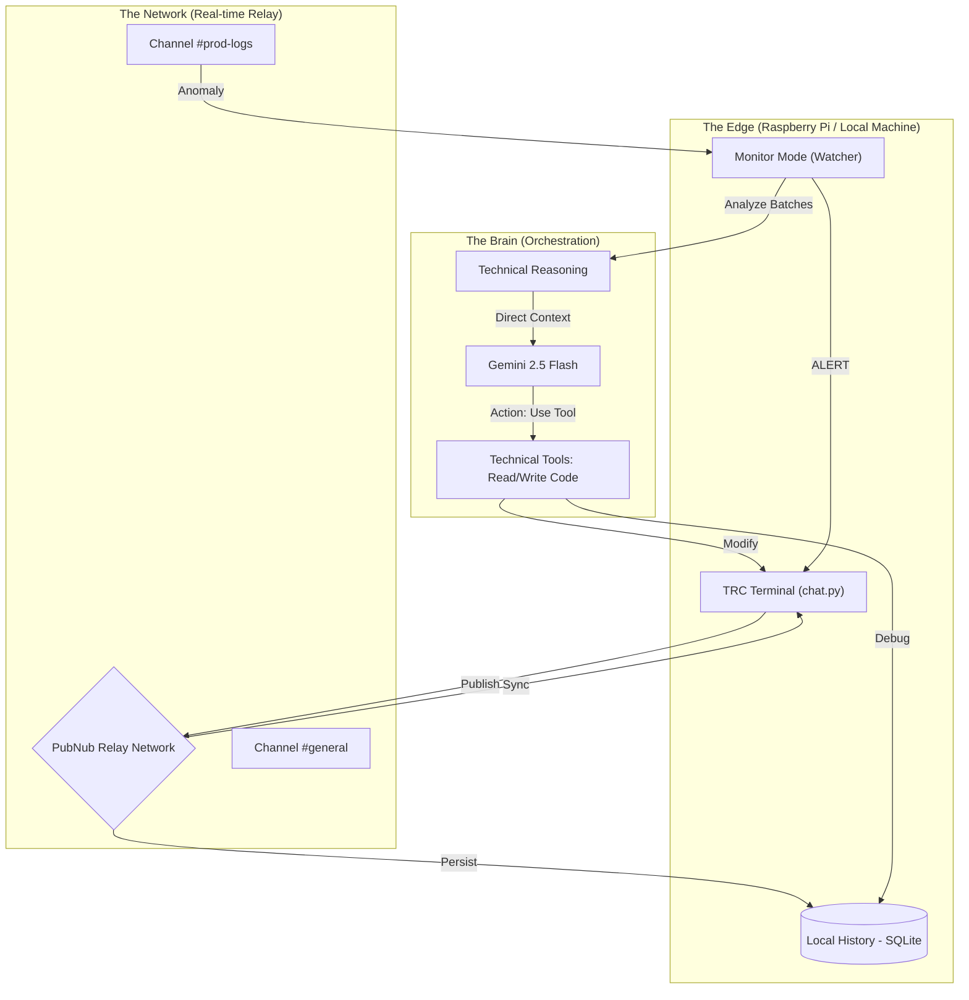

# TRC Architectural Map: The Intelligence Loop 🛰️🧠🏗️

To understand why TRC is "Beyond Chat," it's critical to see how the intelligence flows from raw technical messages to autonomous technical action.

## 💎 The Distinction:
Standard chat apps stop at **Synchronization**. 
TRC completes the **Intelligence Loop**: 
1. **Listen** (PubNub) 
2. **Remember** (SQLite) 
3. **Reason** (Gemini) 
4. **Act** (Local File Tools).

This architecture allows the AI to act as a **Proactive Incident Commander**, not just another participant in the chat. 🎬🦾✨
